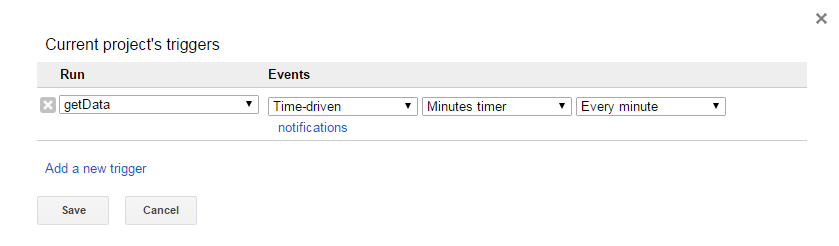
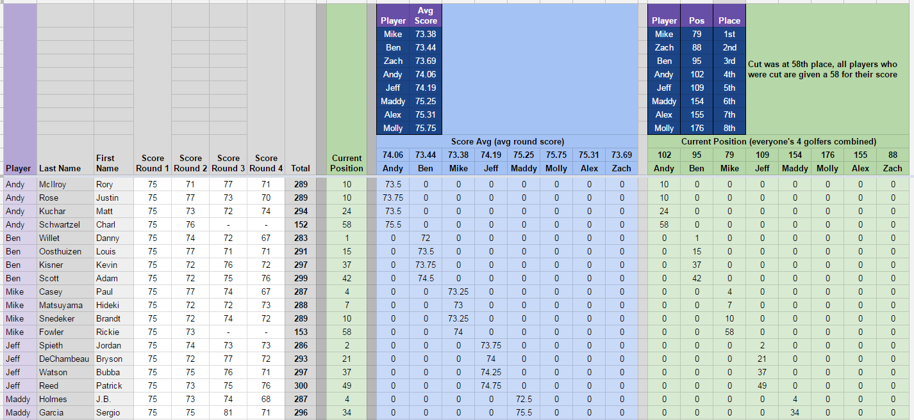

# Masters Tourney
## Synopsis

This is a Google Sheet and script I made for the 2016 Masters with my group of friends. Each person in our competition selected four golfers that we thought would have the lowest cumulative score at the end of the tournament.

## Script Inputs

The [script] (UpdateMastersScores.gs) fetches data using a hyperlink to the tournament leaderboard.

Note that the original sheet used an active link.  The active link is now broken, so I had to result to using the archived web page.  Please let me know if link in the sheet are broken and I will work to update it.

## Motivation

The Google Sheet and script were created to decrease the maintenance of updating the Masters Tourney manually after few minutes.  As long as the leaderboards were updated via the website, the scores on the spreadsheet would be accurate. Seeing that we had 8 people, and multiples golfers to track in our gambling pool, it was much easier to automate this process.

Our competition worked by each person selecting four golfers that would be expected to place the highest at the end of the tournament. Each golfer could only be selected by one person in the snake draft. The lower the score, the better. First place would receive a score of 1, second place a score of 2, etc.  The cut line for this tournment was at 57th place, so any golfers that did not make the cut were given a score of 57.  I surprisingly ended up winning this tournament with my four golfers.

## Installation

View and/or download the [Google Sheet] (https://docs.google.com/spreadsheets/d/10GOV63ZAe_RsPJppBmy7j7ZifcCr81vj0CziURErnZQ/edit#gid=1133131373) to see how the pool worked.

To add an auto-updating script: In Google Sheets, select Tools, then Script Editor.  To add an auto-updating feature, you will need to add 'triggers'.  Go to Edit, then All Your Triggers.  These triggers tell the spreadsheet to run the functions of your script at time intervals of your choice.  In this case, I updated the scores every minute due to the frequently changing golf scores.

## Contributors

Michael Harris is the author of this sheet and script.

[StackOverflow] (http://stackoverflow.com/users/4530995/michael-harris)

[LinkedIN] (https://www.linkedin.com/in/michael-harris-366b0060/)

## License

This code is available under the [MIT License] (LICENSE).

